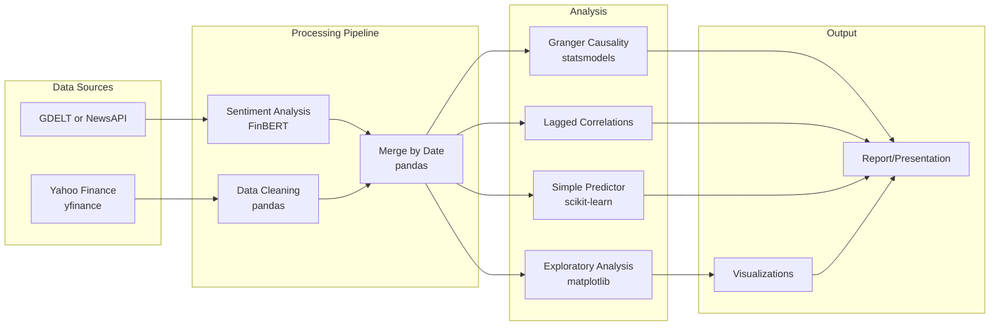

# News-Driven Stock Prediction: Academic Project Plan

## Core Research Question

**"Does sentiment extracted from financial news predict short-term stock price movements, or do price movements cause the news?"**

This framing directly addresses the "smart money" vs "ulica" problem from our notes and gives us a clear, defensible academic thesis.

---

## Scope Decisions (Critical for 1 Month)

**DO focus on:**

- **Primary asset: SPY (S&P 500 ETF)** -- massive news coverage, most liquid ETF, institutional-dominated (ideal for testing the "smart money" hypothesis), macro news maps directly to price, GDELT thematic filters (ECON_INFLATION, etc.) align perfectly
- **Secondary asset (if time permits, week 3+): TSLA** -- heavy retail following ("ulica"), high volatility, extreme news volume. Provides contrast: if Granger test shows returns precede sentiment for SPY but sentiment precedes returns for TSLA, that's a strong academic finding about market efficiency vs retail-driven price action
- Daily granularity (daily closing prices vs daily sentiment scores)
- 6-12 months of historical data for analysis
- Pre-trained FinBERT model (no custom training needed)
- Granger causality test as the core statistical method
- Clear visualizations and a written report

**Strategy**: Get the full pipeline working end-to-end on SPY first (weeks 1-3). Only add TSLA as a comparison if SPY analysis is solid. One well-analyzed asset beats three half-baked ones.

**DO NOT attempt:**

- Real-time bot / live trading (out of scope for 1 month)
- Scraping Twitter/X (API is expensive and unstable)
- Training custom ML models from scratch
- Multiple simultaneous data sources (pick one news source, master it)
- Intraday (minute-level) analysis

---

## Technical Architecture



---

## Technical Stack

All free or within $50 budget:

- **Language**: Python 3.10+
- **Environment**: Jupyter Notebooks (for exploration) + .py scripts (for pipelines)
- **Stock data**: `yfinance` - free, no API key, reliable
- **News data (option A - recommended)**: GDELT via `gdeltdoc` library - free, massive historical data, built-in sentiment scores you can compare against your own
- **News data (option B - simpler)**: NewsAPI free tier - 100 req/day, only 1 month history (limiting but easier API)
- **NLP model**: HuggingFace `transformers` + `ProsusAI/finbert` (pre-trained, free, runs locally)
- **Statistics**: `statsmodels` (Granger test, VAR), `scipy`
- **ML**: `scikit-learn` (logistic regression, random forest for simple prediction)
- **Visualization**: `matplotlib`, `seaborn`, `plotly`
- **Optional dashboard**: `streamlit` (free, simple to build)
- **Version control**: Git + GitHub (free)

### Key Python packages (requirements.txt)

```
yfinance
gdeltdoc
transformers
torch
pandas
numpy
scikit-learn
statsmodels
matplotlib
seaborn
plotly
streamlit
jupyter
```

---

## Team Roles

### Kacper (Data Analysis graduate - strongest technical skills)

- **Lead**: Data pipeline and statistical analysis
- Data cleaning, merging price + sentiment time series
- Granger causality test implementation
- Lagged correlation analysis
- Simple prediction model (logistic regression: does positive sentiment predict up-day?)
- Quality assurance on data integrity

### Jakub (Learning ML/Python, can vibe-code)

- **Lead**: NLP pipeline and project coordination
- Set up the FinBERT sentiment pipeline (HuggingFace makes this ~20 lines of code)
- Score each article/headline with sentiment (positive/negative/neutral + confidence)
- Aggregate daily sentiment scores (mean, weighted by confidence)
- Project management, keeping timeline on track
- Integration between data collection and analysis

### Maja (First-year AI student)

- **Lead**: Data collection, visualization, and presentation
- Write scripts to pull data from Yahoo Finance and GDELT/NewsAPI
- Build visualizations (price vs sentiment over time, correlation heatmaps, etc.)
- Prepare the final presentation / report
- Literature review: find 3-5 academic papers on news-based trading signals
- Document the methodology

---

## 4-Week Schedule

### Week 1: Setup and Data Collection (Days 1-7)

**Everyone:**

- Set up Python environment (Anaconda or venv), install packages
- Create shared GitHub repository
- Target assets decided: SPY primary, TSLA secondary (if time permits)

**Maja:**

- Write `data_collection/get_prices.py` - download daily OHLCV data via yfinance
- Write `data_collection/get_news.py` - download news from GDELT (filter by stock ticker/company name)
- Collect and store raw data in `data/raw/`

**Jakub:**

- Set up FinBERT pipeline: load model, test on sample headlines
- Write `nlp/sentiment.py` - function that takes article text, returns sentiment score
- Test on 10-20 manual examples to verify it works sensibly

**Kacper:**

- Explore raw data quality (missing values, date alignment, timezone issues)
- Design the merged dataset schema: `date | close_price | daily_return | avg_sentiment | num_articles | ...`
- Start `analysis/data_prep.py` - merging and cleaning logic

### Week 2: Processing and Exploration (Days 8-14)

**Jakub:**

- Run FinBERT on all collected articles, store sentiment scores in `data/processed/sentiment_scores.csv`
- Handle edge cases: articles with no relevant content, non-English text, very long articles (context chunking from our notes)

**Kacper:**

- Merge sentiment time series with price data
- Exploratory data analysis: basic statistics, distributions, time series plots
- Check for obvious patterns or data issues

**Maja:**

- Create first visualizations: sentiment over time vs price, volume spikes vs news volume
- Start literature review (3-5 papers)
- Document data sources and methodology

**Milestone:** By end of Week 2, we should have a clean merged dataset ready for analysis.

### Week 3: Statistical Analysis and Modeling (Days 15-21)

**Kacper (primary):**

- Granger causality test: does sentiment Granger-cause returns? Do returns Granger-cause sentiment?
- Lagged cross-correlation analysis (sentiment today vs returns tomorrow, etc.)
- Simple predictive model: logistic regression predicting up/down day from sentiment features
- Test the contrarian hypothesis: does extreme positive sentiment predict negative returns?

**Jakub:**

- Compare FinBERT sentiment vs GDELT's built-in sentiment (if using GDELT) - which correlates better with price moves?
- Help Kacper with model features
- BERTopic experiment (optional): cluster articles to see if topic matters for prediction quality

**Maja:**

- Advanced visualizations: Granger test results, prediction accuracy, confusion matrices
- Start drafting the report/presentation structure

### Week 4: Results, Report, and Presentation (Days 22-30)

**Everyone together:**

- Interpret results: what did we find? Does news predict prices, or vice versa?
- Discuss limitations honestly (this strengthens academic work)
- Finalize the report/presentation

**Maja:** Finish visualizations, polish presentation slides
**Kacper:** Write up statistical methodology and results sections
**Jakub:** Write up NLP pipeline description, overall conclusions, future work section

---

## Key Concepts the Team Should Understand

### The "Smart Money" Problem (from our notes)

The core challenge: insiders and institutional investors act BEFORE news is public. By the time a headline hits Bloomberg, the price has already moved. Our Granger test will directly measure this - if returns Granger-cause sentiment (not the other way around), it confirms the smart money hypothesis.

### Granger Causality Test

Not true causality - it tests whether one time series helps predict another. If past sentiment values improve prediction of future returns (beyond what past returns alone predict), sentiment "Granger-causes" returns. Use `statsmodels.tsa.stattools.grangercausalitytests`. Test both directions.

### FinBERT

A BERT model fine-tuned on financial text. Unlike generic sentiment models, it understands that "yield increased" is financially meaningful. Available free on HuggingFace as `ProsusAI/finbert`. Usage is straightforward:

```python
from transformers import pipeline
finbert = pipeline("sentiment-analysis", model="ProsusAI/finbert")
result = finbert("Tesla stock surges after strong Q3 earnings")
# -> [{'label': 'positive', 'score': 0.95}]
```

### The Contrarian Signal (our best insight)

From our notes: if volume spikes first, then positive news floods in, it is a sell signal. To test this, create a feature like `news_volume_spike` (sudden increase in article count) combined with `high_positive_sentiment`, and check if this combination predicts negative next-day returns.

---

## Required Skills and Learning Resources

### For Jakub (NLP pipeline)

- HuggingFace Transformers basics: [HuggingFace course](https://huggingface.co/learn/nlp-course)
- FinBERT paper: Araci, 2019 - "FinBERT: Financial Sentiment Analysis with Pre-Trained Language Models"

### For Kacper (Statistics)

- Granger causality in Python: statsmodels documentation
- Time series analysis basics: stationarity, ADF test (data must be stationary for Granger test)
- VAR models if time permits

### For Maja (Data + Viz)

- yfinance documentation (very simple API)
- GDELT gdeltdoc library documentation
- matplotlib/seaborn/plotly tutorials

---

## Project Structure

```
MOAI_projekt/
  README.md
  requirements.txt
  data/
    raw/              # Downloaded data (gitignored)
    processed/        # Cleaned, merged datasets
  notebooks/          # Jupyter exploration notebooks
  src/
    data_collection/
      get_prices.py
      get_news.py
    nlp/
      sentiment.py
    analysis/
      data_prep.py
      granger_test.py
      prediction_model.py
  visualizations/     # Saved plots
  report/             # Final report/presentation
  notes/              # Research notes and reference materials
```

---

## Risks and Mitigations

- **Risk**: GDELT data is too complex to parse in week 1 -> **Mitigation**: Fall back to NewsAPI (simpler, but limited history) or use GDELT's pre-computed sentiment scores instead of raw articles
- **Risk**: FinBERT is slow on CPU for thousands of articles -> **Mitigation**: Use Google Colab (free GPU), or only analyze headlines instead of full articles
- **Risk**: No statistically significant results -> **Mitigation**: This is actually a valid academic finding ("news sentiment does not Granger-cause stock returns in our sample, consistent with the efficient market hypothesis")
- **Risk**: Team Python skills slow down progress -> **Mitigation**: Use Jupyter notebooks for experimentation, leverage AI coding assistants, pair-program on complex parts

---

## Budget Allocation ($50)

- NewsAPI paid tier (if needed): $0 (stick with free tier or GDELT)
- Google Colab Pro (if GPU needed for FinBERT): ~$10/month
- Remaining: reserve for any API costs that come up
- Everything else is free and open-source
